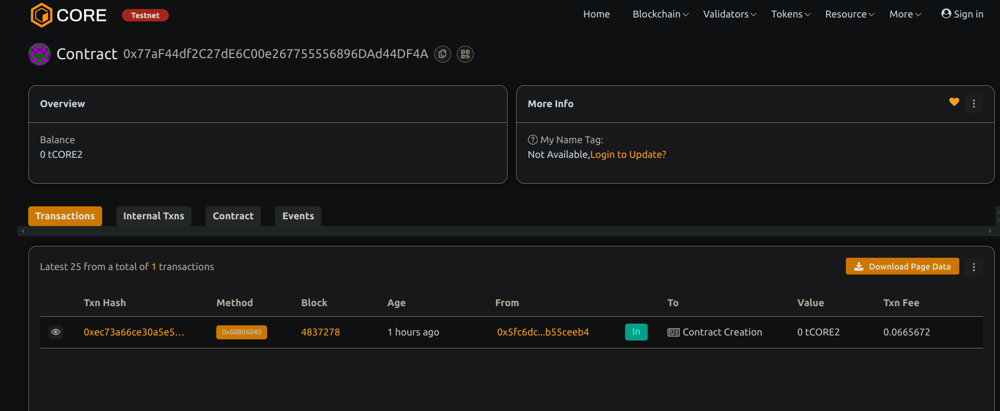

# Crowdfunding Platform

## Project Title
Crowdfunding Platform with Time-Based Funding Goals

## Project Description
This project implements a decentralized crowdfunding platform on the Ethereum blockchain using Solidity. The platform enables creators to launch fundraising campaigns with specific funding goals and time limits. Contributors can back projects they believe in by sending Ether directly to the smart contract.

The key innovation of this platform is its time-based funding mechanism. Each campaign operates with a strict deadline, after which the success of the funding is determined. If a campaign reaches or exceeds its funding goal by the deadline, the creator can withdraw the funds to develop their project. If the goal is not met, contributors can reclaim their funds, implementing the "all-or-nothing" crowdfunding model that protects both creators and backers.

This trustless system eliminates traditional intermediaries, reducing fees and increasing transparency while ensuring funds are only released when predefined conditions are met.

## Project Vision
The vision for this crowdfunding platform is to democratize fundraising by leveraging blockchain technology to create a transparent, efficient, and accessible ecosystem for project financing. By removing centralized control and reducing reliance on traditional financial gatekeepers, we aim to empower creators worldwide to bring their ideas to life while giving contributors confidence that their funds will be used as intended.

This platform addresses key challenges in traditional crowdfunding: high platform fees, payment processing delays, geographical restrictions, and lack of transparency. Our blockchain-based approach provides an immutable record of all transactions, automated fund distribution based on predefined rules, and global accessibility that transcends traditional financial barriers.

## Key Features
- **Time-based Campaigns**: Each campaign has a specific deadline for reaching its funding goal
- **All-or-Nothing Funding Model**: Funds are only released to creators if the goal is reached
- **Automated Refunds**: Contributors can claim refunds if a campaign fails to meet its goal
- **Direct Fund Transfer**: Contributions go directly to the smart contract, not an intermediary
- **Transparent Tracking**: All contributions and campaign statuses are publicly visible on the blockchain
- **Campaign Management**: Creators can set up campaigns with custom titles, descriptions, goals, and durations
- **Multiple Campaign Support**: The platform can handle multiple concurrent fundraising campaigns
- **Event Tracking**: All significant actions emit events for off-chain monitoring and notifications
- **Low Fees**: Eliminating intermediaries significantly reduces platform costs (only network gas fees apply)
- **Trustless Operation**: Smart contract logic ensures that funds are handled according to predefined rules

## Future Scope
- **Milestone-based Funding**: Release funds in stages as creators achieve predefined project milestones
- **Token Rewards**: Enable creators to distribute custom tokens to backers as rewards
- **Campaign Categories**: Implement campaign categorization for improved discovery
- **Featured Campaigns**: Curated lists of highlighted campaigns
- **Social Integration**: Share campaigns across social media platforms
- **Backer Verification**: Optional KYC processes for high-value campaigns
- **Fiat On/Off Ramps**: Integration with services to convert between cryptocurrency and traditional currencies
- **Campaign Updates**: Allow creators to post project updates viewable by backers
- **Backer Communication**: Messaging system between creators and backers
- **Mobile Application**: User-friendly mobile interface for creating and contributing to campaigns
- **Analytics Dashboard**: Detailed statistics and visualizations for campaign performance
- **Multi-chain Support**: Extend functionality across multiple blockchain networks

## Contract details
0x77aF44df2C27dE6C00e267755556896DAd44DF4A
